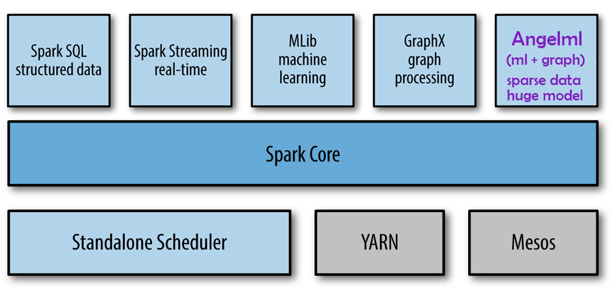
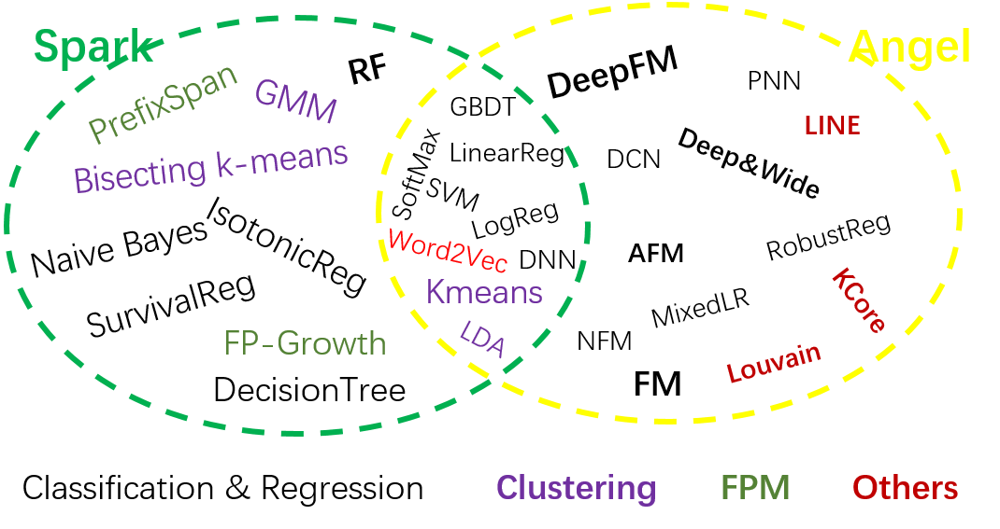
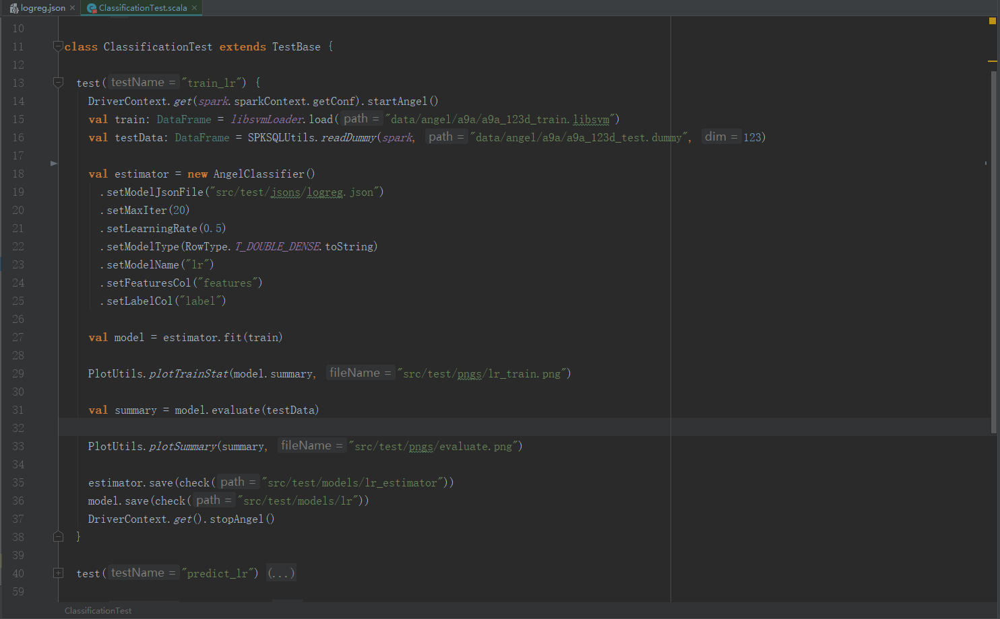

# SONA Overview
Spark On Angel (SONA), arming Spark with a powerful Parameter Server, which enable Spark to train very big models

Similar to Spark MLlib, Spark on Angel is a standalone machine learning library built on Spark (yet it does not rely on Spark MLlib, Figure 1). 
SONA was based on RDD APIs and only included model training step in previous versions. In Angel 3.0, we introduce various new features to SONA:
- Integration of feature engineering into SONA. Instead of simply borrowing Spark’s feature engineering operators, we add support for long index vector to all the operators to enable training of high dimensional sparse models. 
- Seamless connection with automatic hyperparameter tuning.
- Spark-fashion APIs that introduce no cost for Spark users to switch to Angel.
- Support for two new data formats: LibFFM and Dummy.

|  |
|  :----:    |
| *Figure 1: SONA is a another machine learning & graph library on Spark Core*   |

Figure 2 demonstrate the run time architecture of SONA.

|  |
|  :----:    |
| *Figure 2: Architecture of SONA*   |

- There is a `AngelClient` on Spark driver. `AngelClient` is used to start Angel parameter server, create, load, initial and save matrix of the model. 
- There is a `PSClient/PSAgent` on Spark executor. Algorithms can pull parameter and push gradient through `PSAgent`
- The Angel *MLcore* is running in each `Task`

Compared to previous version, a variety of new algorithms were added on SONA, such as Deep & Cross Network (DCN) and 
Attention Factorization Machines (AFM). As can be seen from Figure 2, there are significant differences 
between algorithms on SONA and those on Spark: algorithms on SONA are mainly designated for recommendations 
and graph embedding, while algorithms on Spark tend to be more general-purpose. 

|  |
|  :----:    |
| *Figure 3: Algorithms comparison of Spark and Angel*   |

As a result, SONA can serve as a supplement of Spark

|  |
|  :----:    |
| *Figure 4: Programming Example of SONA*   |

Figure 4 provides an example of running distributed machine learning algorithms on SONA, including following steps:
- Start parameter server at the beginning and stop it in the end.
- Load training and test data as Spark DataFrame.
- Define an Angel model and set parameters in Spark fashion. In this example, the algorithm is defined as a computing graph via JSON.
- Use “fit” method to train the model. 
- Use “evaluate” method to evaluate the trained model. 

## Quick Start
SONA supports three types of runtime models: YARN, K8s and Local. The local mode enable it easy to debug. 
[sona quick start](./docs/tutorials/sona_quick_start.md)
 
## Algorithms
- machine learning algorithms:
    + Traditional Machine Learning Methods
        - [Logistic Regression(LR)](docs/algo/lr_sona_en.md)
        - [Support Vector Machine(SVM)](docs/algo/svm_sona_en.md)
        - [Factorization Machine(FM)](docs/algo/fm_sona_en.md)
        - [Linear Regression](docs/algo/linreg_sona_en.md)
        - [Robust Regression](docs/algo/robust_sona_en.md)
        - [Gradient Boosting Decision Tree](docs/GBDT.md)
        - [Hyper-Parameter Tuning](docs/AutoML.md)
        - [FTRL](docs/algo/ftrl_lr_sona_en.md)
        - [FTRL-FM](docs/algo/ftrl_fm_sona_en.md)
    + Deep Learning Methods
        - [Deep Neural Network(DNN)](docs/algo/dnn_sona_en.md)
        - [Mix Logistic Regression(MLR)](docs/algo/mlr_sona_en.md)
        - [Deep And Wide(DAW)](docs/algo/daw_sona_en.md)
        - [Deep Factorization Machine(DeepFM)](docs/algo/deepfm_sona_en.md)
        - [Neural Factorization Machine(NFM)](docs/algo/nfm_sona_en.md)
        - [Product Neural Network(PNN)](docs/algo/pnn_sona_en.md)
        - [Attention Factorization Machine(AFM)](docs/algo/afm_sona_en.md)
        - [Deep Cross Network(DCN)](docs/algo/dcn_sona_en.md)
- graph algorithms:
    + [Word2Vec](docs/algo/word2vec_sona_en.md)
    + [LINE](docs/algo/line_sona_en.md)
    + [KCore](docs/algo/kcore_sona_en.md)
    + [Louvain](docs/algo/louvain_sona_en.md)

## Deployment

## Support
- QQ account: 20171688

## References

## Other Resources

