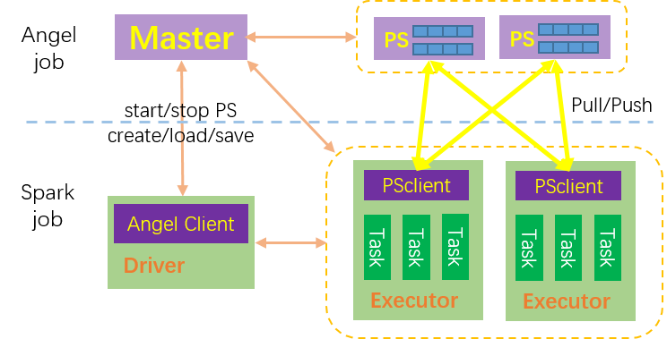

# SONA Overview
Spark On Angel (SONA), arming Spark with a powerful Parameter Server, which enable Spark to train very big models

## Quick Start

## Algorithms
- machine learning algorithms:
    + Traditional Machine Learning Methods
        - [Logistic Regression(LR)](https://github.com/Angel-ML/angel/blob/master/docs/algo/angel_or_spark_on_angel.md)
        - [Support Vector Machine(SVM)](docs/SVM.md)
        - [Factorization Machine(FM)](docs/FM.md)
        - [Linear Regression](docs/LReg.md)
        - [Robust Regression](docs/RR.md)
    + Deep Learning Methods
        - [Deep Neural Network(DNN)](docs/DNN.md)
        - [Mix Logistic Regression(MLR)](docs/MLR.md)
        - [Deep And Wide(DAW)](docs/DAW.md)
        - [Deep Factorization Machine(DeepFM)](docs/DeepFM.md)
        - [Neural Factorization Machine(NFM)](docs/NFM.md)
        - [Product Neural Network(PNN)](docs/PNN.md)
        - [Attention Factorization Machine(AFM)](docs/AFM.md)
        - [Deep Cross Network(DCN)](docs/DCN.md)
- graph algorithms:
    + [Word2Vec](docs/Word2Vec.md)
    + [LINE](docs/LINE.md)
    + [KCore](docs/KCore.md)
    + [Louvain](docs/Word2Vec.md)

## Deployment

## Support
- QQ account: 20171688

## References

## Other Resources

