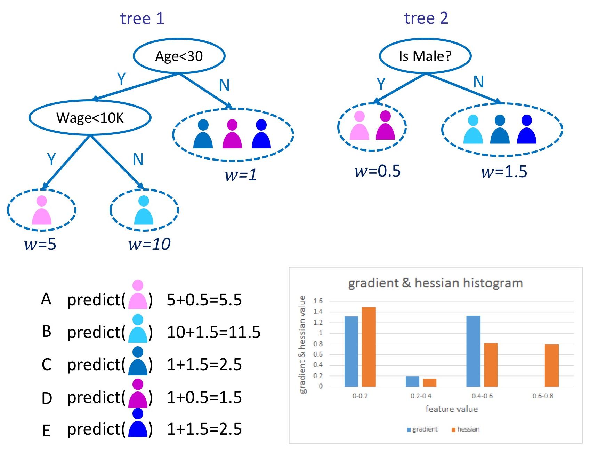
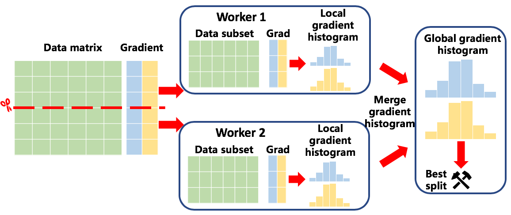
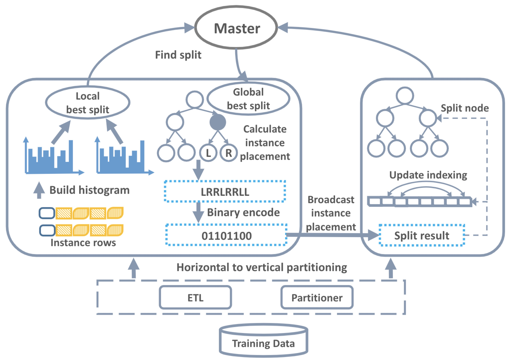

# GBDT on Spark on Angel

> **GBDT(Gradient Boosting Decision Tree)** is an ensemble machine learning algorithm that trains a set of regression trees.

## 1. Introduction of GBDT



The above figure is an example of predicting the consumption of consumers.

1. In the first tree, the root node use the feature of age. 
Consumers older than 30 are classified to the left tree node, while those younger than 30 is classified to the right node.
The prediction of the right node is 1.
2. Then, the left tree node is splited. The split feature is salary.
3. Once the first tree is built, the predictions of C, D and E are updated to 1, 5, and 10.
4. Build the second tree with new predictions. Update the predictions of consumers by adding the predictions of the second tree.
5. This process iterates until satisfying the stopping criteria.

## 2. Distributed training

Spark on Angel supports two modes of distributed training, **data parallelism** and **feature parallelism**.

### Data parallelism

The core data structure of training GBDT is called gradient histogram.
GBDT bulild one first-order gradient histogram and one second-order gradient histogram for each feature.
Since data parallelism partitions the training data by row, every worker builds gradient histogram using a data subset.
Then, it finds the best split result via merging local gradient histograms through the network.



### Feature parallelism

Since the size of gradient histogram is affected by four factors: the number of features, the number of splits, the number of classes, and the number of tree nodes.
For high-dimensional features, large classes and deep trees, the size of gradient histogram can be very large,
causing several problems for data parallelism.
 
1. Expensive memory cost. Every worker needs to store a whole copy of gradient histograms.
2. Expensive communication cost. Workers need to exchange local gradient histograms through the network.

To address the drawbacks of data parallelism, Spark on Angel implements feature parallelism.
Different from data parallelism, the training process is as follows.



1. **Data transformation.** 
Since the original datasets are generally stored in distributed file systems by rows, SONA loads the dataset and transforms to feature subsets.
2. **Build gradient histogram.**
Every worker builds gradient histograms for a feature subset.
3. **Find the best split.** 
Each worker calculates the best split (split feature and split value) with local gradient histograms.
Workers get the global best split by exchanging local best splits.
4. **Calculate split result.**
Since each worker only stores a feature subset, the split result of training data is only known by one worker.
This worker broadcasts the split result (binary format) to other workers.
5. **Split tree node**.
Each worker splits tree node and updates tree structure.

Compared with data parallelism, feature parallelism makes each worker build gradient histograms for a feature subset, the memory cost is reduced.
Besides, feature parallelism does not need to merge gradient histogram through the network, thus the communication cost is reduced.

## 3. 运行

###  输入格式
参数的输入格式均为key:value，如ml.feature.index.range:100代表数据集有100维特征。

> **_注意:_**  目前GBDT on Spark on Angel仅支持libsvm格式的输入数据，由于libsvm格式特征id从1开始，因此在运行时需要将特征维度+1。

### 参数

* **输入输出参数**
	* ml.train.path：训练数据的输入路径
	* ml.valid.path：验证数据的输入路径
	* ml.predict.input.path：预测数据的输入路径
	* ml.predict.output.path：预测结果的保存路径
	* ml.model.path：训练完成后模型的保存路径，或预测开始前模型的加载路径

* **任务参数**
  * ml.gbdt.task.type：任务类型，支持分类（classification）和回归（regression）
  * ml.gbdt.parallel.mode：并行类型，支持数据并行（dp）和特征并行（fp）
  * ml.gbdt.importance.type：特征重要度，训练完成后与模型一起存储，支持特征分裂总次数（weight）、特征平均分裂增益（gain）和特征总分裂增益（total_gain），默认total_gain
  * ml.num.class：分类数量，仅对分类任务有用
  * ml.feature.index.range：数据集特征维度
  * ml.instance.sample.ratio：样本采样比例（0到1之间），默认不采样
  * ml.feature.sample.ratio：特征采样比例（0到1之间），默认不采样
* **优化参数**
  * ml.gbdt.round.num：训练轮次，默认20轮
  * ml.learn.rate：学习速率，默认0.1
  * ml.gbdt.loss.func：代价函数，分类任务支持二分类（binary:logistic）、多分类（multi:logistic）和均方根误差（rmse），回归任务固定为均方根误差（rmse）
  * ml.gbdt.eval.metric：模型指标，支持rmse、error、log-loss、cross-entropy、precision和auc，以逗号分隔
  * ml.gbdt.reduce.lr.on.plateau：是否当验证集上的指标连续多轮无明显提升时下降学习速率，true或false，默认true
  * ml.gbdt.reduce.lr.on.plateau.patient：指标无明显提升的轮数，默认5轮
  * ml.gbdt.reduce.lr.on.plateau.threshold：指标明显提升的阈值，默认0.0001
  * ml.gbdt.reduce.lr.on.plateau.decay.factor：学习速率下降的比例，默认0.1
  * ml.gbdt.reduce.lr.on.plateau.early.stop：当多次学习速率下降后指标仍然无明显提升时，提前结束训练，默认为3次，（若取-1，则不会提前结束训练）
  * ml.gbdt.best.checkpoint：是否仅存储在验证集上达到最优指标的模型（对二分类任务，指标为log-loss，对多分类任务，指标为cross-entropy，对回归任务，指标为rmse），true或false，默认true
* **决策树参数**
  * ml.gbdt.split.num：每个特征的分裂点的数量，默认20
  * ml.gbdt.tree.max.depth：树的最大深度，默认6
  * ml.gbdt.leaf.wise：是否采用深度优先方法训练一棵树，否则采用逐层方法，true或false，默认false
  * ml.gbdt.max.node.num：每棵树的最大树节点数量，默认127（即深度为6的完全树）
  * ml.gbdt.min.child.weight：分裂树节点后子节点的最小hessian值，默认0
  * ml.gbdt.min.node.instance：可分裂树节点上数据的最少样本数量，默认1024
  * ml.gbdt.reg.alpha：正则化系数，默认0
  * ml.gbdt.reg.lambda：正则化系统，默认1
  * ml.gbdt.max.leaf.weight：叶子节点的最大预测值（绝对值），若为0则不限制预测值，默认0
  * ml.gbdt.min.split.gain：分裂树节点需要的最小增益，默认0
* **多分类任务参数**
  * ml.gbdt.multi.tree：是否使用一轮多棵树（即多个one-vs-rest二分类器），否则一轮一棵树（即单个多分类器），仅当多分类任务时有效，true或false，默认false
  * ml.gbdt.full.hessian：是否使用全量hessian矩阵计算，否则使用对角近似hessian矩阵，仅当一轮一棵树时有效，true或false，默认false

> **_注意:_**  使用全量hessian矩阵要求存储所有训练样本的hessian矩阵，需要较大的存储空间，而且会造成较高的计算开销；同时实验表明，使用对角近似矩阵的准确率与使用全量矩阵相近或更高。因此，除非多分类类别数量较少且类别之间有强相互关系，否则请不要使用全量矩阵进行计算。

### 训练任务启动命令示例

使用spark提交任务

```shell
./spark-submit \
    --master yarn --deploy-mode cluster \
    --name "GBDT on Spark-on-Angel" \
    --queue $queue \
    --driver-memory 5g \  
    --num-executors 10 \  
    --executor-cores 1 \  
    --executor-memory 10g \   
    --class org.apache.spark.angel.ml.tree.gbdt.predict.GBDTPredictor \  
    angelml-${SONA_VERSION}.jar \   
    ml.train.path:XXX ml.valid.path:XXX ml.model.path:XXX \  
    ml.gbdt.parallel.mode:fp \ 
    ml.gbdt.importance.type:total_gain \
    ml.gbdt.task.type:classification \
    ml.gbdt.loss.func:binary:logistic ml.gbdt.eval.metric:log-loss,error,auc \  
    ml.num.class:2 \
    ml.feature.index.range:100 \ 
    ml.instance.sample.ratio:0.8 \ 
    ml.feature.sample.ratio:0.8 \ 
    ml.gbdt.round.num:100 \
    ml.learn.rate:0.05    
```

### 预测任务启动命令示例

使用spark提交任务

```shell
./spark-submit \
      --master yarn --deploy-mode cluster \ 
      --name "GBDT on Spark-on-Angel" \
      --queue $queue \
      --driver-memory 5g \  
      --num-executors 10 \  
      --executor-cores 1 \  
      --executor-memory 10g \   
      --class org.apache.spark.angel.ml.tree.gbdt.predict.GBDTPredictor \  
      angelml-${SONA_VERSION}.jar \
      ml.model.path:XXX ml.predict.input.path:XXX ml.predict.output.path:XXX
```


