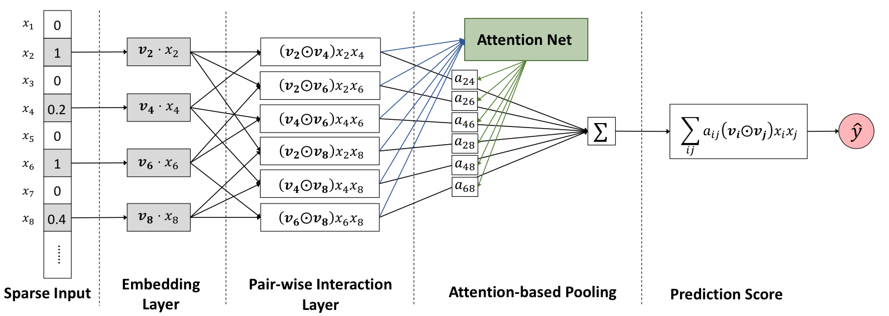
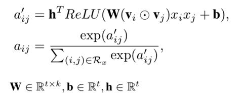

# AFM

## 1. Introduction
AFM(Attention Neural Factorization Machines) is a improved FM method, which  which learns the importance of each feature interaction from data via a neural attention network.



### 1.1 BiInteractionCrossTiled layer
BiInteractionCrossTiled is a layer that calculates each second-order feature interaction and concatenates them as a vector.

### 1.2 ParamSharedFC layer

ParamSharedFC layer is a fully connected layer with shared parameters, as explained in the following formulas, where w is the shared parameters for every feature interaction. h is another shared parameter vector for the next layer. The attention weights are calculated by applying a softmax operation on the layer's output. 



## 2. Execution 
### 2.1 Network Construction by Json

```json
  {
    "data": {
      "format": "dummy",
      "indexrange": 148,
      "numfield": 13,
      "validateratio": 0.1
    },
    "model": {
      "modeltype": "T_FLOAT_SPARSE",
      "modelsize": 148
    },
    "train": {
      "epoch": 5,
      "numupdateperepoch": 10,
      "lr": 1.0,
      "decay": 0.01
    },
    "default_optimizer": "Momentum",
    "layers": [
      {
        "name": "wide",
        "type": "simpleinputlayer",
        "outputdim": 1,
        "transfunc": "identity"
      },
      {
        "name": "embedding",
        "type": "embedding",
        "numfactors": 8,
        "outputdim": 104,
        "optimizer": {
          "type": "momentum",
          "momentum": 0.9,
          "reg2": 0.01
        }
      },
      {
        "name": "biinteractioncrosstiled",
        "type": "BiInteractionCrossTiled",
        "outputdim": 624,
        "inputlayer": "embedding"
      },
      {
        "name": "paramsharedfc",
        "type": "ParamSharedFC",
        "outputdims": [
          780,
          78
        ],
        "transfuncs": [
          "relu",
          "softmax"
        ],
        "weightdims": [
          10,
          1
        ],
        "inputlayer": "biinteractioncrosstiled"
      },
      {
        "name": "weightedsum",
        "type": "WeightedSumLayer",
        "outputdim": 8,
        "inputlayers": [
          "paramsharedfc",
          "biinteractioncrosstiled"
        ]
      },
      {
        "name": "fclayer_1",
        "type": "FCLayer",
        "outputdims": [1],
        "transfuncs": ["identity"],
        "inputlayer": "weightedsum"
      },
      {
        "name": "sumPooling",
        "type": "SumPooling",
        "outputdim": 1,
        "inputlayers": [
          "wide",
          "fclayer_1"
        ]
      },
      {
        "name": "simplelosslayer",
        "type": "losslayer",
        "lossfunc": "logloss",
        "inputlayer": "sumPooling"
      }
    ]
  }
```

### 2.2 Submitting script

Several steps must be done before editing the submitting script and running.

1. confirm Hadoop and Spark have ready in your environment
2. unzip sona-<version>-bin.zip to local directory (SONA_HOME)
3. upload sona-<version>-bin directory to HDFS (SONA_HDFS_HOME)
4. Edit $SONA_HOME/bin/spark-on-angel-env.sh, set SPARK_HOME, SONA_HOME, SONA_HDFS_HOME and ANGEL_VERSION

Here's an example of submitting scripts, remember to adjust the parameters and fill in the paths according to your own task.

```
#test description
actionType=train or predict
jsonFile=path-to-jsons/afm.json
modelPath=path-to-save-model
predictPath=path-to-save-predict-results
input=path-to-data
queue=your-queue

HADOOP_HOME=my-hadoop-home
source ./bin/spark-on-angel-env.sh
export HADOOP_HOME=$HADOOP_HOME

$SPARK_HOME/bin/spark-submit \
  --master yarn-cluster \
  --conf spark.ps.jars=$SONA_ANGEL_JARS \
  --conf spark.ps.instances=10 \
  --conf spark.ps.cores=2 \
  --conf spark.ps.memory=10g \
  --jars $SONA_SPARK_JARS \
  --files $jsonFile \
  --driver-memory 20g \
  --num-executors 20 \
  --executor-cores 5 \
  --executor-memory 30g \
  --queue $queue \
  --class org.apache.spark.angel.examples.JsonRunnerExamples \
  ./lib/angelml-$SONA_VERSION.jar \
  jsonFile:./afm.json \
  dataFormat:libsvm \
  data:$input \
  modelPath:$modelPath \
  predictPath:$predictPath \
  actionType:$actionType \
  numBatch:500 \
  maxIter:2 \
  lr:4.0 \
  numField:39
```