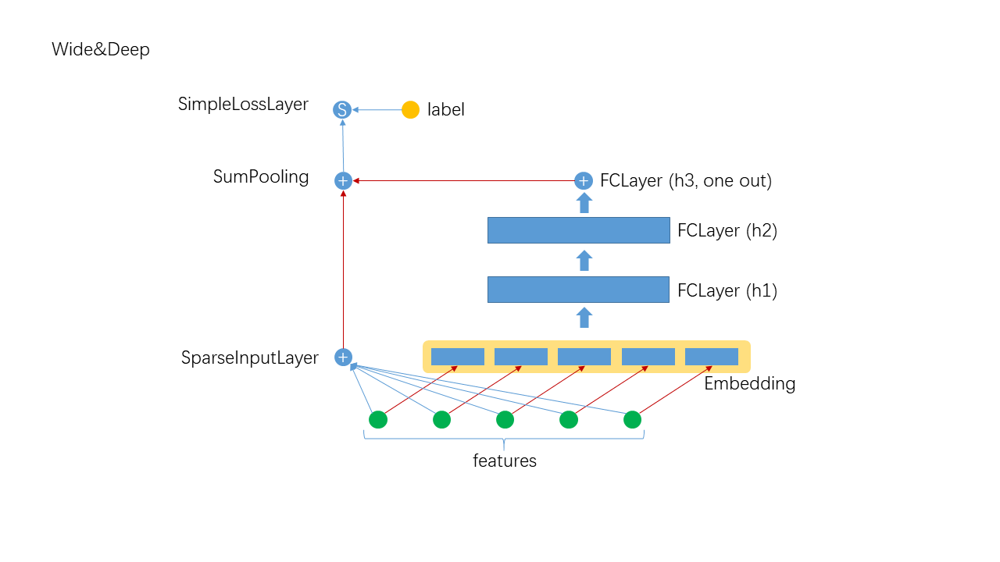

# Deep and Wide

## 1. Algorithm Introduction
The Deep and Wide algorithm directly extracts the results of Embedding into the DNN to further extract high-order feature intersections, and finally it combines the first-order features with the higher-order features for prediction. The framework is as follows:


### 1.1 The layers in Deep and Wide
- SimpleInputLayer: sparse data input layer, which optimizes sparse high-dimensional data, is essentially a FCLayer.
- Embedding: implicit embedding layer, if the feature is not one-hot, multiplied by the eigenvalue.
- FCLayer: the most common layer in DNN, linear transformation followed by transfer function.
- SumPooling: adding multiple input data to element-wise, requiring the input have the same shape.
- SimpleLossLayer: loss layer, different loss functions can be specified

### 1.2 Network Construction

```scala
  override def buildNetwork(): Unit = {
    val wide = new SimpleInputLayer("input", 1, new Identity(),
      JsonUtils.getOptimizerByLayerType(jsonAst, "SparseInputLayer"))

    val embeddingParams = JsonUtils.getLayerParamsByLayerType(jsonAst, "Embedding")
      .asInstanceOf[EmbeddingParams]
    val embedding = new Embedding("embedding", embeddingParams.outputDim, embeddingParams.numFactors,
      embeddingParams.optimizer.build()
    )

    val hiddenLayer = JsonUtils.getFCLayer(jsonAst, embedding)

    val join = new SumPooling("sumPooling", 1, Array[Layer](wide, hiddenLayer))

    new SimpleLossLayer("simpleLossLayer", join, lossFunc)
  }
```

## 2. Operation and Performance
### 2.1 The description of Json configuration file
When Deep and wide have more parameters, they need to be specified in the form of a Json configuration file(see [Json description](../basic/json_conf_en.md) for a complete description of the Json configuration file), A typical example is as follows:
```json
{
  "data": {
    "format": "dummy",
    "indexrange": 148,
    "numfield": 13,
    "validateratio": 0.1
  },
  "model": {
    "modeltype": "T_DOUBLE_SPARSE_LONGKEY",
    "modelsize": 148
  },
  "train": {
    "epoch": 10,
    "numupdateperepoch": 10,
    "lr": 0.1,
    "decay": 0.8
  },
  "default_optimizer": {
    "type": "momentum",
    "momentum": 0.9,
    "reg2": 0.01
  },
  "layers": [
    {
      "name": "wide",
      "type": "simpleinputlayer",
      "outputdim": 1,
      "transfunc": "identity"
    },
    {
      "name": "embedding",
      "type": "embedding",
      "numfactors": 8,
      "outputdim": 104
    },
    {
      "name": "fclayer",
      "type": "FCLayer",
      "inputlayer": "embedding",
      "outputdims": [
        100,
        100,
        1
      ],
      "transfuncs": [
        "relu",
        "relu",
        "identity"
      ]
    },
    {
      "name": "sumPooling",
      "type": "SumPooling",
      "outputdim": 1,
      "inputlayers": [
        "wide",
        "fclayer"
      ]
    },
    {
      "name": "simplelosslayer",
      "type": "simplelosslayer",
      "lossfunc": "logloss",
      "inputlayer": "sumPooling"
    }
  ]
}
```

### 2.2 Submitting script

Several steps must be done before editing the submitting script and running.

1. confirm Hadoop and Spark have ready in your environment
2. unzip sona-<version>-bin.zip to local directory (SONA_HOME)
3. upload sona-<version>-bin directory to HDFS (SONA_HDFS_HOME)
4. Edit $SONA_HOME/bin/spark-on-angel-env.sh, set SPARK_HOME, SONA_HOME, SONA_HDFS_HOME and ANGEL_VERSION

Here's an example of submitting scripts, remember to adjust the parameters and fill in the paths according to your own task.

```
#test description
actionType=train or predict
jsonFile=path-to-jsons/daw.json
modelPath=path-to-save-model
predictPath=path-to-save-predict-results
input=path-to-data
queue=your-queue

HADOOP_HOME=my-hadoop-home
source ./bin/spark-on-angel-env.sh
export HADOOP_HOME=$HADOOP_HOME

$SPARK_HOME/bin/spark-submit \
  --master yarn-cluster \
  --conf spark.ps.jars=$SONA_ANGEL_JARS \
  --conf spark.ps.instances=10 \
  --conf spark.ps.cores=2 \
  --conf spark.ps.memory=10g \
  --jars $SONA_SPARK_JARS \
  --files $jsonFile \
  --driver-memory 20g \
  --num-executors 20 \
  --executor-cores 5 \
  --executor-memory 30g \
  --queue $queue \
  --class org.apache.spark.angel.examples.JsonRunnerExamples \
  ./lib/angelml-$SONA_VERSION.jar \
  jsonFile:./daw.json \
  dataFormat:libsvm \
  data:$input \
  modelPath:$modelPath \
  predictPath:$predictPath \
  actionType:$actionType \
  numBatch:500 \
  maxIter:2 \
  lr:4.0 \
  numField:39
```