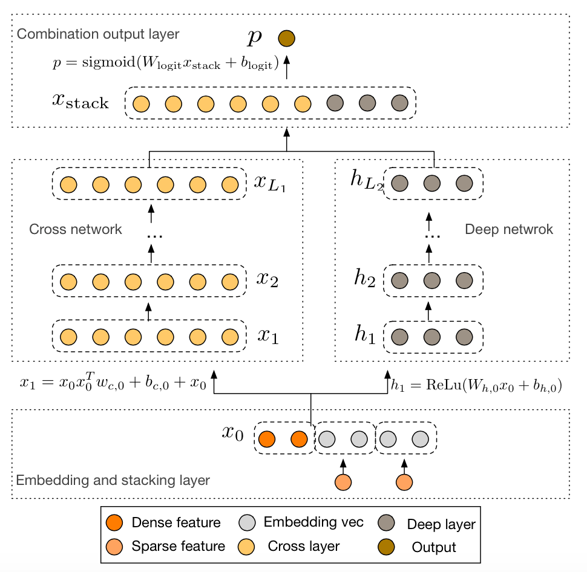
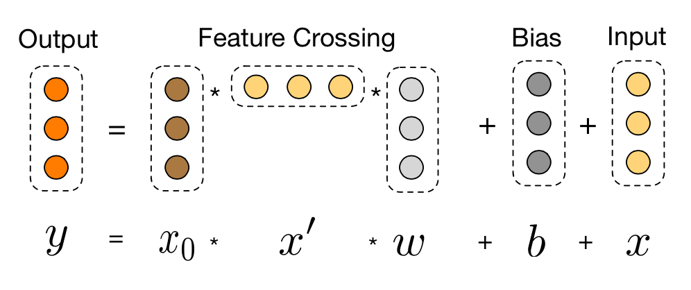

# DCN

## 1. Introduction
DCN(Deep & Cross Network) explicitly applies feature crossing at each layer, requires no manual feature engineering, and adds negligible extra complexity to the DNN model.



### 1.1 Cross Layer

DCN is combined of two parts: cross network and deep network. The deep network is a simple dnn, stacked by several fully connected layers. The Cross network, in other hands, is stacked by  several cross layers. Each cross layer has two inputs: the original embedding layer and the output of the last cross layer. The calculating method is as follows.



### 1.2 Combination

Outputs of deep network and cross network are simply concatenated.

## 2. Execution & Performance
### 2.1 Network Construction by Json

```json
  {
    "data": {
      "format": "dummy",
      "indexrange": 148,
      "numfield": 13,
      "validateratio": 0.1
    },
    "model": {
      "modeltype": "T_FLOAT_SPARSE",
      "modelsize": 148
    },
    "train": {
      "epoch": 15,
      "numupdateperepoch": 10,
      "lr": 0.01,
      "decayclass": "WarmRestarts",
      "decayalpha": 0.05
    },
    "default_optimizer": "adam",
    "layers": [
      {
        "name": "embedding",
        "type": "embedding",
        "numfactors": 8,
        "outputdim": 104,
        "optimizer": {
          "type": "momentum",
          "momentum": 0.9,
          "reg2": 0.01
        }
      },
      {
        "name": "deep",
        "type": "FCLayer",
        "outputdims": [
          400,
          104
  
        ],
        "transfuncs": [
          "relu",
          "identity"
        ],
        "inputlayer": "embedding"
      },
      {
        "name": "cross1",
        "type": "CrossLayer",
        "outputdim": 104,
        "inputlayers": [
          "embedding",
          "embedding"
        ]
      },
      {
        "name": "cross2",
        "type": "CrossLayer",
        "outputdim": 104,
        "inputlayers": [
          "embedding",
          "cross1"
        ]
      },
      {
        "name": "concat",
        "type": "ConcatLayer",
        "outputdim": 208,
        "inputlayers": [
          "deep",
          "cross2"
        ]
      },
      {
        "name": "lr",
        "type": "FCLayer",
        "outputdims": [
          1
        ],
        "transfuncs": [
          "identity"
        ],
        "inputlayer": "concat"
      },
      {
        "name": "simplelosslayer",
        "type": "losslayer",
        "lossfunc": "logloss",
        "inputlayer": "lr"
      }
    ]
  }
```

### 2.2 Submitting script

Several steps must be done before editing the submitting script and running.

1. confirm Hadoop and Spark have ready in your environment
2. unzip sona-<version>-bin.zip to local directory (SONA_HOME)
3. upload sona-<version>-bin directory to HDFS (SONA_HDFS_HOME)
4. Edit $SONA_HOME/bin/spark-on-angel-env.sh, set SPARK_HOME, SONA_HOME, SONA_HDFS_HOME and ANGEL_VERSION

Here's an example of submitting scripts, remember to adjust the parameters and fill in the paths according to your own task.

```
#test description
actionType=train or predict
jsonFile=path-to-jsons/dcn.json
modelPath=path-to-save-model
predictPath=path-to-save-predict-results
input=path-to-data
queue=your-queue

HADOOP_HOME=my-hadoop-home
source ./bin/spark-on-angel-env.sh
export HADOOP_HOME=$HADOOP_HOME

$SPARK_HOME/bin/spark-submit \
  --master yarn-cluster \
  --conf spark.ps.jars=$SONA_ANGEL_JARS \
  --conf spark.ps.instances=10 \
  --conf spark.ps.cores=2 \
  --conf spark.ps.memory=10g \
  --jars $SONA_SPARK_JARS \
  --files $jsonFile \
  --driver-memory 20g \
  --num-executors 20 \
  --executor-cores 5 \
  --executor-memory 30g \
  --queue $queue \
  --class org.apache.spark.angel.examples.JsonRunnerExamples \
  ./lib/angelml-$SONA_VERSION.jar \
  jsonFile:./dcn.json \
  dataFormat:libsvm \
  data:$input \
  modelPath:$modelPath \
  predictPath:$predictPath \
  actionType:$actionType \
  numBatch:500 \
  maxIter:2 \
  lr:4.0 \
  numField:39
```