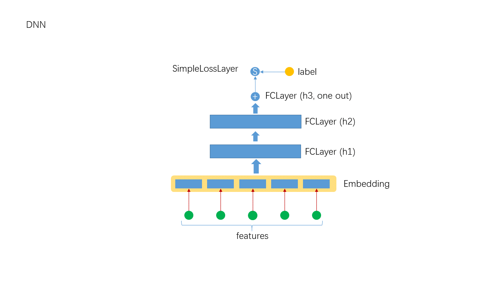

# DNN

DNN is the first algorithm to be supported by each deep learning platform. As a deep learning platform, Angel does not have a built-in DNN implementation, but it provides a way for users to implement their own deep learning algorithms. In fact, DeepFM, PNN, NFM, Deep and Wide can be implemented by the methods described in this paper.



Angel provides the function of using Json to configure the algorithm, and also provides the function of defining the algorithm with Json. The following example is the implementation of DNN.
## 1. Network defined by Json

### 1.1 Definition of Input Layer

```json
{
    "name": "denseinputlayer",
    "type": "simpleinputlayer",
    "outputdim": 500,
    "transfunc": "relu",
    "optimizer": "ftrl"
},
```
Here we use a DenseInputLayer as the input layer, the output dimension is 500, and Relu is used as the transfer function. For other layers to refer to it, we name the input layer "denseinputlayer".

In particular, Angel allows different parts of the network to use different optimizers. Here, we specify DenseInputLayer to use FTRL optimizer (about optimizer, please refer to [Optimizer in Angel](../basic/optimizer_on_angel.md)) 

### 1.2 Definition of FClayer
```json
{
    "name": "fclayer",
    "type": "FCLayer",
    "outputdims": [
        100,
        1
    ],
    "transfuncs": [
        "relu",
        "identity"
    ],
    "inputlayer": "denseinputlayer"
},
```

There are two FCLayer:
- The first FCLayer
    - Named "fclayer_0"
    - The output dimension is 100
    - The transfer function is "Relu"
- The second FCLayer
    - Named "fclayer"
    - The output dimension is 1
    - The transfer function is "identity"

As you can see from the above, FCLayer uses a simple writing method, please refer to [Json's definition](../basic/json_conf_en.md). The simple “inputlayer” is the input of the first FCLayer, The simple name is used as the name of the last FCLayer. The middle Layer is named by "fclayer_x", which means the number of the FCLayer, starting from 0.

In addition, the input of “FCLayer” is the output of the upper layer "denseinputlayer".

Note: FCLayer does not specify an optimizer, it will use the default optimizer, Momentum.

### 1.3 The Definition of Loss Layer    

```json
{
    "name": "simplelosslayer",
    "type": "simplelosslayer",
    "lossfunc": "logloss",
    "inputlayer": "fclayer"
}
```

the type of loss function is SimpleLossLayer, the loss function is "logloss", and the input layer is "fclayer".

## 2. The Definition of Data-related Parameters
```json
  "data": {
    "format": "libsvm",
    "indexrange": 300,
    "validateratio": 0.2,
    "posnegratio": 0.1
  },
```

Refer to [Json definition](../basic/json_conf_en.md) for the meaning of the detailed parameters. For example, some parameters are listed here:

- format: input data format
- indexrange: feature dimension
- validateratio: proportion of verification set
- posnegratio: turn on sampling and set the ratio of positive and negative samples

## 3. The Definition of Model-related Parameters
```json
  "model": {
    "modeltype": "T_DOUBLE_SPARSE",
    "modelsize": 300
  },
```
Refer to [Json definition](../basic/json_conf_en.md) for the meaning of the detailed parameters. For example, some parameters are listed here:

- model type: T_DOUBLE_SPARSE
- model size: the actual size of the model(number of valid features)

## 4. The Definition of training Parameters
```json
  "train": {
    "epoch": 30,
    "numupdateperepoch": 10,
    "lr": 0.1,
    "decayclass": "WarmRestarts",
    "decaybeta": 0.001
  },
```

Refer to [Json definition](../basic/json_conf_en.md) for the meaning of the detailed parameters. For example, some parameters are listed here:
- epoch: number of training rounds
- lr: learning rate
- decayclass: learning rate attenuation      
- decayalpha: learning rate attenuation parameter
- decaybeta: learning rate attenuation parameter


## 5. Putting all the configurations together
```json
{
  "data": {
    "format": "libsvm",
    "indexrange": 300,
    "validateratio": 0.2,
    "posnegratio": 0.1
  },
  "model": {
    "modeltype": "T_DOUBLE_SPARSE",
    "modelsize": 300
  },
  "train": {
    "epoch": 30,
    "lr": 0.1,
    "decayclass": "WarmRestarts",
    "decaybeta": 0.001
  },
  "default_optimizer": "momentum",
  "layers": [
    {
      "name": "simpleinputlayer",
      "type": "simpleinputlayer",
      "outputdim": 500,
      "transfunc": "relu"
    },
    {
      "name": "fclayer",
      "type": "FCLayer",
      "outputdims": [
        100,
        1
      ],
      "transfuncs": [
        "relu",
        "identity"
      ],
      "inputlayer": "denseinputlayer"
    },
    {
      "name": "simplelosslayer",
      "type": "simplelosslayer",
      "lossfunc": "logloss",
      "inputlayer": "fclayer"
    }
  ]
}

```


### 2.2 Submitting script

Several steps must be done before editing the submitting script and running.

1. confirm Hadoop and Spark have ready in your environment
2. unzip angel-<version>-bin.zip to local directory (ANGEL_HOME)
3. upload angel-<version>-bin directory to HDFS (ANGEL_HDFS_HOME)
4. Edit $ANGEL_HOME/bin/spark-on-angel-env.sh, set SPARK_HOME, ANGEL_HOME, ANGEL_HDFS_HOME and ANGEL_VERSION

Here's an example of submitting scripts, remember to adjust the parameters and fill in the paths according to your own task.

```
#test description
actionType=train or predict
jsonFile=path-to-jsons/dnn.json
modelPath=path-to-save-model
predictPath=path-to-save-predict-results
input=path-to-data
queue=your-queue

HADOOP_HOME=my-hadoop-home
source ./bin/spark-on-angel-env.sh
export HADOOP_HOME=$HADOOP_HOME

$SPARK_HOME/bin/spark-submit \
  --master yarn-cluster \
  --conf spark.ps.jars=$SONA_ANGEL_JARS \
  --conf spark.ps.instances=10 \
  --conf spark.ps.cores=2 \
  --conf spark.ps.memory=10g \
  --jars $SONA_SPARK_JARS \
  --files $jsonFile \
  --driver-memory 20g \
  --num-executors 20 \
  --executor-cores 5 \
  --executor-memory 30g \
  --queue $queue \
  --class org.apache.spark.angel.examples.JsonRunnerExamples \
  ./lib/angelml-$SONA_VERSION.jar \
  jsonFile:./dnn.json \
  dataFormat:libsvm \
  data:$input \
  modelPath:$modelPath \
  predictPath:$predictPath \
  actionType:$actionType \
  numBatch:500 \
  maxIter:2 \
  lr:4.0 \
  numField:39
```