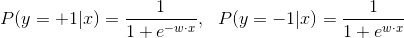
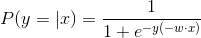
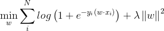
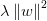
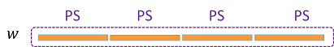

# Linear Regression
> Logistic Regression is a regression model where the dependent variable is categorical, thus also a classification model. It is simple but effective, widely used in a variety of applications such as the traditional advertising recommender system.   

## 1. Introduction

Logistic regression is a simple classification method. It assumes that the probability mass of class label y conditional on data point x, P(y|x), takes the logistic form:    

  

Combining the two expressions above, we get:

  


The objective function of logistic regression is a weighted sum of log loss and L2 penalty:     

  

where  is the regularization term using the L2 norm. 

## 2. Distributed Implementation on Angel
### 1. Model Storage
LR algorithm can be abstracted as a 1×N PSModel, denoted by w, as shown in the following figure:


### 2. Algorithm Logic
Angel MLLib provides LR algorithm trained with the mini-batch gradient descent method. 

* Worker:    
In each iteration, worker pulls the up-to-date w from PS, updates the model parameters, △w, using the mini-batch gradient descent optimization method, and push △w back to PS. 
* PS:    
In each iteration, PS receives △w from all workers, add their average to w，obtaining a new model.    
  * Flow:      
  
  * Algorithm:
  


* Decaying learning rate    
The learning rate decays along iterations as , where:
	* α is the decay rate 
	* T is the iteration/epoch

* Model Type
The LR algorithm supports three types of models: DoubleDense, DoubleSparse, DoubleSparseLongKey. Use `ml.lr.model.type` to configure. 
	* DoubleDense
		* Parameters: -- ml.lr.model.type: T_DOUBLE_DENSE
		* Description: DoubleDense type model is suitable for dense data; model saved as array to save space; quick access and high performance
	* DoubleSparse
		* Parameters: -- ml.lr.model.type：T_DOUBLE_SPARSE
		* Description: DoubleSparse type model is suitable for sparse data; model saved as map, where K is feature ID and V is feature value; range of K same as range of Int
	* DoubleSparseLongKey
		* Parameters: -- ml.lr.model.type：T_DOUBLE_SPARSE_LONGKEY
		* DoubleSparseLongKey type model is suitable for highly sparse data; model saved as map, where K is feature ID and V is feature value; range of K same as range of Long

## 3. Execution & Performance

### Input Format

* Data fromat is set in "ml.data.type", supporting "libsvm" and "dummy" types. For details, see [Angel Data Format](data_format_en.md)
* Feature vector's dimension is set in "ml.feature.index.range"

### Submitting script

Several steps must be done before editing the submitting script and running.

1. confirm Hadoop and Spark have ready in your environment
2. unzip sona-<version>-bin.zip to local directory (SONA_HOME)
3. upload sona-<version>-bin directory to HDFS (SONA_HDFS_HOME)
4. Edit $SONA_HOME/bin/spark-on-angel-env.sh, set SPARK_HOME, SONA_HOME, SONA_HDFS_HOME and ANGEL_VERSION

Here's an example of submitting scripts, remember to adjust the parameters and fill in the paths according to your own task.

```
#test description
actionType=train or predict
jsonFile=path-to-jsons/linreg.json
modelPath=path-to-save-model
predictPath=path-to-save-predict-results
input=path-to-data
queue=your-queue

HADOOP_HOME=my-hadoop-home
source ./bin/spark-on-angel-env.sh
export HADOOP_HOME=$HADOOP_HOME

$SPARK_HOME/bin/spark-submit \
  --master yarn-cluster \
  --conf spark.ps.jars=$SONA_ANGEL_JARS \
  --conf spark.ps.instances=10 \
  --conf spark.ps.cores=2 \
  --conf spark.ps.memory=10g \
  --jars $SONA_SPARK_JARS \
  --files $jsonFile \
  --driver-memory 20g \
  --num-executors 20 \
  --executor-cores 5 \
  --executor-memory 30g \
  --queue $queue \
  --class org.apache.spark.angel.examples.JsonRunnerExamples \
  ./lib/angelml-$SONA_VERSION.jar \
  jsonFile:./linreg.json \
  dataFormat:libsvm \
  data:$input \
  modelPath:$modelPath \
  predictPath:$predictPath \
  actionType:$actionType \
  numBatch:500 \
  maxIter:2 \
  lr:4.0 \
  numField:39
```