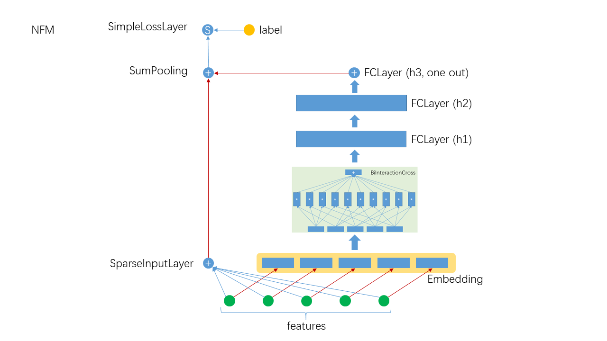

# NFM

## 1. Introduction of Algorithm
NFM (Neural Factorization Machines) algorithm is based on Embedding,  multiply each pairs of corresponding elements of Embedding results, and then add to obtain a vector which has the same dimension as Embedding, and then input into DNN to further extract the high-order crossed feature. It is worth noting that NFM does not abandon the first-order feature, and finally the first-order feature are combined with higher-order features for prediction, and the framework is as follows:



### 1.1  Description of the BiInnerCross layer
In implementation, it is stored by Embedding, After calling Embedding's 'calOutput', computing and output result together. So the Embedding output of a sample is

=(\bold{u}_1,\bold{u}_2,\bold{u}_3,\cdots,\bold{u}_k))

The calculation formula for BiInteractionCross is as follows:

\\\\&=\frac{1}{2}(\sum_i\bold{u}_i)\otimes(\sum_j\bold{u}_j)-\sum_i\bold{u}_i^2\\\\&=\frac{1}{2}[(\sum_i\bold{u}_i)^2-\sum_i\bold{u}_i^2]\end{array})

Implemented as Scala code as:
```scala
  val sum1Vector = VFactory.denseDoubleVector(outputDim)
  val sum2Vector = VFactory.denseDoubleVector(outputDim)
  (0 until batchSize).foreach { row =>
      mat.getRow(row).getPartitions.foreach { vectorOuter =>
      sum1Vector.iadd(vectorOuter)
      sum2Vector.iadd(vectorOuter.mul(vectorOuter))
    }

    blasMat.setRow(row, sum1Vector.imul(sum1Vector).isub(sum2Vector).imul(0.5))
    sum1Vector.clear()
    sum2Vector.clear()
  }
```

### 1.2 Description of other layers
- SparseInputLayer: Sparse data input layer, specially optimized for sparse high-dimensional data, essentially a FClayer
- Embedding: Implicit embedding layer, if the feature is not one-hot, multiply the feature value
- FCLayer: The most common layer in DNN, linear transformation followed by transfer function
- SumPooling: Adding multiple input data as element-wise, requiring inputs have the same shape
- SimpleLossLayer: Loss layer, you can specify different loss functions

### 1.3 Building Network
```scala
  override def buildNetwork(): Unit = {
    val wide = new SparseInputLayer("input", 1, new Identity(),
      JsonUtils.getOptimizerByLayerType(jsonAst, "SparseInputLayer"))

    val embeddingParams = JsonUtils.getLayerParamsByLayerType(jsonAst, "Embedding")
      .asInstanceOf[EmbeddingParams]
    val embedding = new Embedding("embedding", embeddingParams.outputDim, embeddingParams.numFactors,
      embeddingParams.optimizer.build()
    )

    val interactionCross = new BiInteractionCross("BiInteractionCross", embeddingParams.numFactors, embedding)
    val hiddenLayer = JsonUtils.getFCLayer(jsonAst, interactionCross)

    val join = new SumPooling("sumPooling", 1, Array[Layer](wide, hiddenLayer))

    new SimpleLossLayer("simpleLossLayer", join, lossFunc)
  }
```

## 2. Running and performance
### 2.1 Explanation of Json configuration File
There are many parameters of NFM, which need to be specified by Json configuration file (for a complete description of Json configuration file, please refer to[Json explanation](../basic/json_conf_en.md)), A typical example is:
```json
{
  "data": {
    "format": "dummy",
    "indexrange": 148,
    "numfield": 13,
    "validateratio": 0.1
  },
  "model": {
    "modeltype": "T_FLOAT_SPARSE_LONGKEY",
    "modelsize": 148
  },
  "train": {
    "epoch": 10,
    "numupdateperepoch": 10,
    "lr": 0.01,
    "decay": 0.1
  },
  "default_optimizer": "Momentum",
  "layers": [
    {
      "name": "wide",
      "type": "sparseinputlayer",
      "outputdim": 1,
      "transfunc": "identity"
    },
    {
      "name": "embedding",
      "type": "embedding",
      "numfactors": 8,
      "outputdim": 104,
      "optimizer": {
        "type": "momentum",
        "momentum": 0.9,
        "reg2": 0.01
      }
    },
    {
      "name": "biinteractioncross",
      "type": "BiInteractionCross",
      "outputdim": 8,
      "inputlayer": "embedding"
    },
    {
      "name": "fclayer",
      "type": "FCLayer",
      "outputdims": [
        50,
        50,
        1
      ],
      "transfuncs": [
        "relu",
        "relu",
        "identity"
      ],
      "inputlayer": "biinteractioncross"
    },
    {
      "name": "sumPooling",
      "type": "SumPooling",
      "outputdim": 1,
      "inputlayers": [
        "wide",
        "fclayer"
      ]
    },
    {
      "name": "simplelosslayer",
      "type": "simplelosslayer",
      "lossfunc": "logloss",
      "inputlayer": "sumPooling"
    }
  ]
}
```
### 2.2 Submitting script

Several steps must be done before editing the submitting script and running.

1. confirm Hadoop and Spark have ready in your environment
2. unzip angel-<version>-bin.zip to local directory (ANGEL_HOME)
3. upload angel-<version>-bin directory to HDFS (ANGEL_HDFS_HOME)
4. Edit $ANGEL_HOME/bin/spark-on-angel-env.sh, set SPARK_HOME, ANGEL_HOME, ANGEL_HDFS_HOME and ANGEL_VERSION

Here's an example of submitting scripts, remember to adjust the parameters and fill in the paths according to your own task.

```
#test description
actionType=train or predict
jsonFile=path-to-jsons/nfm.json
modelPath=path-to-save-model
predictPath=path-to-save-predict-results
input=path-to-data
queue=your-queue

HADOOP_HOME=my-hadoop-home
source ./bin/spark-on-angel-env.sh
export HADOOP_HOME=$HADOOP_HOME

$SPARK_HOME/bin/spark-submit \
  --master yarn-cluster \
  --conf spark.ps.jars=$SONA_ANGEL_JARS \
  --conf spark.ps.instances=10 \
  --conf spark.ps.cores=2 \
  --conf spark.ps.memory=10g \
  --jars $SONA_SPARK_JARS \
  --files $jsonFile \
  --driver-memory 20g \
  --num-executors 20 \
  --executor-cores 5 \
  --executor-memory 30g \
  --queue $queue \
  --class org.apache.spark.angel.examples.JsonRunnerExamples \
  ./lib/angelml-$SONA_VERSION.jar \
  jsonFile:./nfm.json \
  dataFormat:libsvm \
  data:$input \
  modelPath:$modelPath \
  predictPath:$predictPath \
  actionType:$actionType \
  numBatch:500 \
  maxIter:2 \
  lr:4.0 \
  numField:39
```