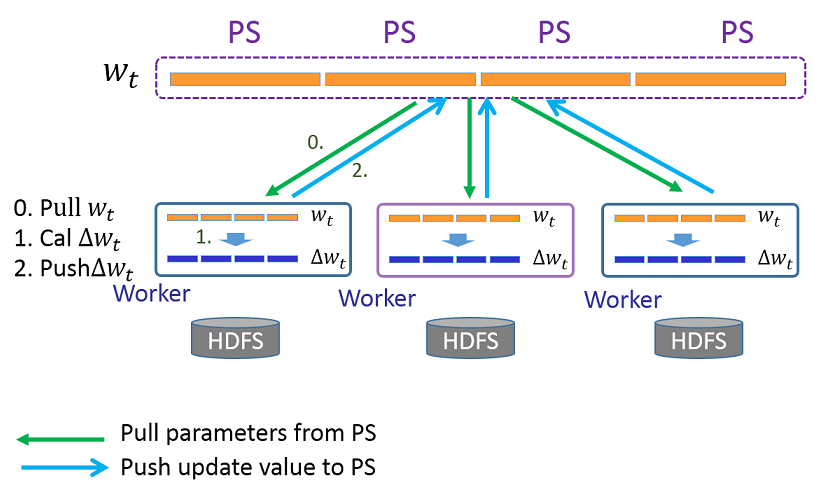
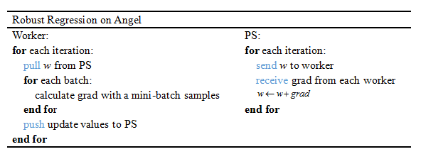
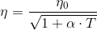

# Robust Regression

> Robust Regression is a regression model, which also models the relationship between one or more independent variables and a dependent variable. The difference is that it aims to overcome some limitations of traditional parametric and non-parametric methods, such as misleading results when the assumptions of ordinary least squares are not true, while robust regression is designed not to be overly influenced by the violation of assumptions in the basic data generation process.   

## 1. Introduction

Robust regression is a strong regression method for outliers. Given a data set ,i=1,\ldots,n) of n statistical units, a linear regression model assumes that the relationship between the dependent variable  and the   of regressors X is linear. This relationship is modeled through a disturbance term or error variable ε — an unobserved random variable that adds "noise" to the linear relationship between the dependent variable and regressors. However, if the noise is caused by abnormal measurement error or other violations of standard assumptions, then the validity of the conventional linear regression model will be affected. The robust regression model is improved in this respect, and the allowable variance depends on the independent variable X. The model is expressed in the following form:

  

The robust regression adopts Huber loss function, which divides the residuals into different segments and uses different loss calculation methods for the residuals of different segments.

)={\begin{cases}{\frac{1}{2}}\sum_{{i=1}}^{n}{(y_i-f(x_i))^{2}}&{\text{for}}|y_i-f(x_i)|\leq\delta\\\\\delta\sum_{{i=1}}^{n}(|y_i-f(x_i)|-{\frac{1}{2}})&{\text{otherwise.}}\end{cases}})

where ,({\displaystyle{i}=1,2,\ldots,n)) is a group of samples. This method combine the square loss and absolute loss together to avoid being dominated by particularly large outliers.

## 2. Distributed Implementation on Angel
### 1. Model Storage
Robust regression algorithm can be abstracted as a 1×N PSModel, denoted by w, where ), as shown in the following figure:


### 2. Algorithm Logic
Angel MLLib provides Robust regression algorithm trained with the mini-batch gradient descent method. 

* Worker:    
In each iteration, worker pulls the up-to-date w from PS, updates the model parameters, △w, using the mini-batch gradient descent optimization method, and push △w back to PS. 
* PS:    
In each iteration, PS receives △w from all workers, add their average to w，obtaining a new model.    
  * Flow:      
  
	  
  * Algorithm:
 
	  


* Decaying learning rate    
The learning rate decays along iterations as , where:
	* α is the decay rate 
	* T is the epoch

## 3. Execution & Performance

### Input Format

* Data fromat is set in "ml.data.type", supporting "libsvm", "dense" and "dummy" types. For details, see [Angel Data Format](data_format_en.md)
* Model size is  set in "ml.model.size", for some sparse model, there are features that all samples are zero at those indices (invalidate indices), therefore ml.model.size = ml.feature.index.range - number of invalidate indices
* Feature vector's dimension is set in "ml.feature.index.range"


### Submitting script

Several steps must be done before editing the submitting script and running.

1. confirm Hadoop and Spark have ready in your environment
2. unzip angel-<version>-bin.zip to local directory (ANGEL_HOME)
3. upload angel-<version>-bin directory to HDFS (ANGEL_HDFS_HOME)
4. Edit $ANGEL_HOME/bin/spark-on-angel-env.sh, set SPARK_HOME, ANGEL_HOME, ANGEL_HDFS_HOME and ANGEL_VERSION

Here's an example of submitting scripts, remember to adjust the parameters and fill in the paths according to your own task.

```
#test description
actionType=train or predict
jsonFile=path-to-jsons/robustreg.json
modelPath=path-to-save-model
predictPath=path-to-save-predict-results
input=path-to-data
queue=your-queue

HADOOP_HOME=my-hadoop-home
source ./bin/spark-on-angel-env.sh
export HADOOP_HOME=$HADOOP_HOME

$SPARK_HOME/bin/spark-submit \
  --master yarn-cluster \
  --conf spark.ps.jars=$SONA_ANGEL_JARS \
  --conf spark.ps.instances=10 \
  --conf spark.ps.cores=2 \
  --conf spark.ps.memory=10g \
  --jars $SONA_SPARK_JARS \
  --files $jsonFile \
  --driver-memory 20g \
  --num-executors 20 \
  --executor-cores 5 \
  --executor-memory 30g \
  --queue $queue \
  --class org.apache.spark.angel.examples.JsonRunnerExamples \
  ./lib/angelml-$SONA_VERSION.jar \
  jsonFile:./robustreg.json \
  dataFormat:libsvm \
  data:$input \
  modelPath:$modelPath \
  predictPath:$predictPath \
  actionType:$actionType \
  numBatch:500 \
  maxIter:2 \
  lr:4.0 \
  numField:39
```