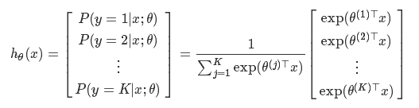
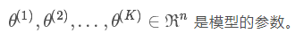
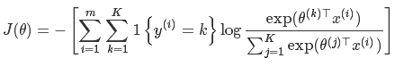
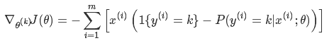

# SoftMax Regression
 
> Softmax regression is also known as multivariate logistic regression, which deals with multi-classification problems through logistic regression algorithms. Unlike binary logistic regression, softmax can handle the classification problem of K categorical variables.

## 1. Introduction
### SoftMax Regression     
* SoftMax Regression Model

Given the test input x, it is assumed that the probability P(y = k|x) can be estimated of different k values for the same sample (where k = 1, ..., K). It is assumed that the output is a K-dimensional vector(the sum of the vector is 1), which represents the estimated probability value corresponding to K categories. Assume that the probability estimation function as follows:


where，

The loss function expression is as follows:


We also usually solve the above expressions in an iterative manner. Here is the gradient expression for the iterative process:


## 2. SoftMax on Angel
* Softmax Algorithm Model
The softmax algorithm consists of only a single input layer, which can be "dense" or "sparse". Like the logistic regression algorithm, the softmax model only has one output which is the classification result. The diferent point is that softmax's loss function uses softmax loss.

* softmax regression training process
    Angel implements the gradient descent method optimization, and gets the model by iterative training. The logic of each iteration of the worker and PS is as follows:       
    * worker：Each iteration pulls the weight vector corresponding to the matrix from the PS to the local, and calculates the update value of the corresponding gradient, then pushes it to the gradient vector corresponding to the PS. Note that the corresponding model weights are pulled according to the feature index corresponding to each sample on the worker side, which can reduce the communication cost and save the memory to improve the calculation efficiency.
    * PS：PS summarizes the gradient update values pushed by all workers, averages them, calculates new model weights through the optimizer and updates accordingly.
    
* softmax regression predict
    * format：rowID,pred,prob,label
    * note：
	    * rowID indicates the row ID of the sample, counting from 0; 
	    * pred: the predicted value of the sample; 
	    * prob: the probability that the sample is relative to the predicted result; 
	    * label: the category to which the predicted sample is classified, and the sample is divided into one category which has the maximum probability, the category label starts counting from 0
    
## 3. Execution & Performance
### Input Format
Data fromat is set in "ml.data.type", supporting "libsvm", "dense" and "dummy" types. For details, see [Angel Data Format](data_format_en.md)
where the "libsvm" format is as follows:
 ```
 1 1:1 214:1 233:1 234:1
 ```   
 where the "dummy" format is as follows：
    
 ```
 1 1 214 233 234
 ```

### Submitting script

Several steps must be done before editing the submitting script and running.

1. confirm Hadoop and Spark have ready in your environment
2. unzip sona-<version>-bin.zip to local directory (SONA_HOME)
3. upload sona-<version>-bin directory to HDFS (SONA_HDFS_HOME)
4. Edit $SONA_HOME/bin/spark-on-angel-env.sh, set SPARK_HOME, SONA_HOME, SONA_HDFS_HOME and ANGEL_VERSION

Here's an example of submitting scripts, remember to adjust the parameters and fill in the paths according to your own task.

```
#test description
actionType=train or predict
jsonFile=path-to-jsons/softmax.json
modelPath=path-to-save-model
predictPath=path-to-save-predict-results
input=path-to-data
queue=your-queue

HADOOP_HOME=my-hadoop-home
source ./bin/spark-on-angel-env.sh
export HADOOP_HOME=$HADOOP_HOME

$SPARK_HOME/bin/spark-submit \
  --master yarn-cluster \
  --conf spark.ps.jars=$SONA_ANGEL_JARS \
  --conf spark.ps.instances=10 \
  --conf spark.ps.cores=2 \
  --conf spark.ps.memory=10g \
  --jars $SONA_SPARK_JARS \
  --files $jsonFile \
  --driver-memory 20g \
  --num-executors 20 \
  --executor-cores 5 \
  --executor-memory 30g \
  --queue $queue \
  --class org.apache.spark.angel.examples.JsonRunnerExamples \
  ./lib/angelml-$SONA_VERSION.jar \
  jsonFile:./softmax.json \
  dataFormat:libsvm \
  data:$input \
  modelPath:$modelPath \
  predictPath:$predictPath \
  actionType:$actionType \
  numBatch:500 \
  maxIter:2 \
  lr:4.0 \
  numField:39
```